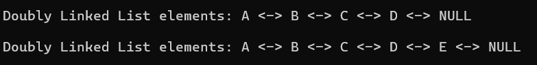
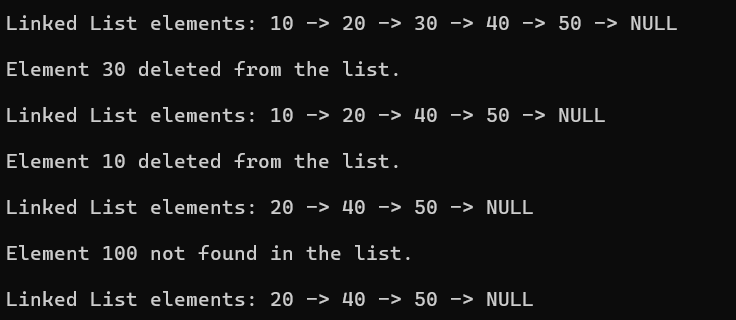

# EXP NO:16 C PROGRAM TO SEARCH A GIVEN ELEMENT IN THE GIVEN LINKED LIST.

## Aim:
To write a C program to search a given element in the given linked list.

## Algorithm:
1.	Define the structure for a node in a linked list.
2.	Define the search function to find a specific character in the linked list.
3.	Initialize the head of the linked list as needed.
4.	Call the search function and perform other linked list operations as needed.
 
## Program:

``` c
#include <stdio.h>
#include <stdlib.h>

struct Node 
{
    char data;
    struct Node* next;
};

struct Node* createNode(char value) 
{
    struct Node* newNode = (struct Node*)malloc(sizeof(struct Node));
    newNode->data = value;
    newNode->next = NULL;
    return newNode;
}

void insertEnd(struct Node** head, char value) 
{
    struct Node* newNode = createNode(value);
    if (*head == NULL) 
	{
        *head = newNode;
        return;
    }
    struct Node* temp = *head;
    while (temp->next != NULL) 
	{
        temp = temp->next;
    }
    temp->next = newNode;
}

void searchElement(struct Node* head, char key) 
{
    int position = 1;
    struct Node* temp = head;
    while (temp != NULL) 
	{
        if (temp->data == key) 
		{
            printf("\nElement '%c' found at position %d\n", key, position);
            return;
        }
        temp = temp->next;
        position++;
    }
    printf("\nElement '%c' not found in the list\n", key);
}

void display(struct Node* head) 
{
    if (head == NULL) 
	{
        printf("\nLinked List is empty!\n");
        return;
    }
    printf("\nLinked List elements: ");
    while (head != NULL) 
	{
        printf("%c -> ", head->data);
        head = head->next;
    }
    printf("NULL\n");
}

int main() 
{
    struct Node* head = NULL;

    insertEnd(&head, 'A');
    insertEnd(&head, 'B');
    insertEnd(&head, 'C');
    insertEnd(&head, 'D');
    insertEnd(&head, 'E');

    display(head);

    searchElement(head, 'C');
    searchElement(head, 'X');

    return 0;
}
```

## Output:


## Result:
Thus, the program to search a given element in the given linked list is verified successfully.

---
 
# EXP NO:17  PROGRAM TO INSERT A NODE IN A LINKED LIST.

## Aim:
To write a C program to insert a node in a linked list.

## Algorithm:
1.	Define the structure for a node in a linked list
2.	Define the insert function to insert a new node with character data at the end of the linked list.
3.	Initialize the head of the linked list as needed.
4.	Call the insert function and perform other linked list operations as needed.
 
## Program:

``` c
#include <stdio.h>
#include <stdlib.h>

struct Node 
{
    char data;
    struct Node* next;
};

struct Node* createNode(char value) 
{
    struct Node* newNode = (struct Node*)malloc(sizeof(struct Node));
    newNode->data = value;
    newNode->next = NULL;
    return newNode;
}

void insertEnd(struct Node** head, char value) 
{
    struct Node* newNode = createNode(value);
    if (*head == NULL) 
	{
        *head = newNode;
        return;
    }
    struct Node* temp = *head;
    while (temp->next != NULL) 
	{
        temp = temp->next;
    }
    temp->next = newNode;
}

void display(struct Node* head) 
{
    if (head == NULL) 
	{
        printf("\nLinked List is empty!\n");
        return;
    }
    printf("\nLinked List elements: ");
    while (head != NULL) 
	{
        printf("%c -> ", head->data);
        head = head->next;
    }
    printf("NULL\n");
}

int main() {
    struct Node* head = NULL;

    insertEnd(&head, 'A');
    insertEnd(&head, 'B');
    insertEnd(&head, 'C');
    insertEnd(&head, 'D');

    display(head);

    return 0;
}
```
## Output:


 
## Result:
Thus, the program to insert a node in a linked list is verified successfully.

---
 
# EXP NO:18 C PROGRAM TO TRAVERSE A DOUBLY LINKED LIST

## Aim:
To write a C program to traverse a doubly linked list.

## Algorithm:
1.	Initialize a temporary pointer (temp) to the head of the list.
2.	Use a while loop to traverse the list until the end (temp == NULL) is reached.
3.	Inside the loop, print the data of the current node.
4.	Move to the next node by updating the temp pointer to point to the next node (temp = temp->next).
 
## Program:

```c
#include <stdio.h>
#include <stdlib.h>

struct Node {
    char data;
    struct Node* prev;
    struct Node* next;
};

struct Node* createNode(char value) {
    struct Node* newNode = (struct Node*)malloc(sizeof(struct Node));
    newNode->data = value;
    newNode->prev = NULL;
    newNode->next = NULL;
    return newNode;
}

void insertEnd(struct Node** head, char value) {
    struct Node* newNode = createNode(value);
    if (*head == NULL) {
        *head = newNode;
        return;
    }
    struct Node* temp = *head;
    while (temp->next != NULL) 
	{
        temp = temp->next;
    }
    temp->next = newNode;
    newNode->prev = temp;
}

void traverse(struct Node* head) 
{
    struct Node* temp = head;
    if (temp == NULL) 
	{
        printf("\nDoubly Linked List is empty!\n");
        return;
    }
    printf("\nDoubly Linked List elements: ");
    while (temp != NULL)
	 {
        printf("%c <-> ", temp->data);
        temp = temp->next;
    }
    printf("NULL\n");
}

int main() {
    struct Node* head = NULL;

    insertEnd(&head, 'A');
    insertEnd(&head, 'B');
    insertEnd(&head, 'C');
    insertEnd(&head, 'D');

    traverse(head);

    return 0;
}
```

## Output:


## Result:
Thus, the program to traverse a doubly linked list is verified successfully. 

---

# EXP NO:19 C PROGRAM TO INSERT AN ELEMENT IN DOUBLY LINKED LIST

## Aim:
To write a C program to insert an element in doubly linked list

## Algorithm:
1.	Create a new node (newNode) and allocate memory for it.
2.	Set the data of the new node to the provided value.
3.	If the list is empty, set the new node as the head.
4.	If the list is not empty, traverse the list to find the last node.
5.	Set the new node's prev pointer to the last node and update the last node's next pointer to the new node.
 
## Program:

``` c
#include <stdio.h>
#include <stdlib.h>

struct Node {
    char data;
    struct Node* prev;
    struct Node* next;
};

struct Node* createNode(char value) {
    struct Node* newNode = (struct Node*)malloc(sizeof(struct Node));
    newNode->data = value;
    newNode->prev = NULL;
    newNode->next = NULL;
    return newNode;
}

void insertEnd(struct Node** head, char value) {
    struct Node* newNode = createNode(value);
    if (*head == NULL) {
        *head = newNode;
        return;
    }
    struct Node* temp = *head;
    while (temp->next != NULL) {
        temp = temp->next;
    }
    temp->next = newNode;
    newNode->prev = temp;
}

void display(struct Node* head) {
    if (head == NULL) {
        printf("\nDoubly Linked List is empty!\n");
        return;
    }
    printf("\nDoubly Linked List elements: ");
    while (head != NULL) {
        printf("%c <-> ", head->data);
        head = head->next;
    }
    printf("NULL\n");
}

int main() {
    struct Node* head = NULL;

    insertEnd(&head, 'A');
    insertEnd(&head, 'B');
    insertEnd(&head, 'C');
    insertEnd(&head, 'D');

    display(head);

    insertEnd(&head, 'E'); // inserting new element

    display(head);

    return 0;
}
```

## Output:



## Result:
Thus, the program to insert an element in doubly linked list is verified successfully.

---


# EXP NO:20 C FUNCTION TO DELETE A GIVEN ELEMENT IN THE GIVEN LINKED LIST

## Aim:
To write a C function that deletes a given element from a linked list.

## Algorithm:
1.	Check if the Linked List is Empty:
o	If the head of the linked list is NULL, print a message indicating the list is empty and exit the function.
2.	Traverse the Linked List:
o	Start from the head node and iterate through the list to find the node that contains the given element (data).
3.	Handle Deletion of the First Node:
o	If the element to be deleted is found in the head node:
	Update the head of the linked list to point to the next node (i.e., head = head->next).
	Free the memory allocated to the node to be deleted.
	Exit the function.
4.	Traverse and Delete from the Middle or End:
o	If the element is not in the head node, continue traversing the list by checking each node’s next pointer.
o	When the node with the element is found, update the previous node’s next pointer to point to the next node of the node to be deleted (prev->next = current->next).
o	Free the memory allocated to the node to be deleted.
5.	Handle the Case when the Element is Not Found:
o	If the element is not found in any node, print a message indicating the element is not present in the list.
6.	End the Function.


## Program:

```c
#include <stdio.h>
#include <stdlib.h>

struct Node {
    int data;
    struct Node* next;
};

struct Node* createNode(int value) {
    struct Node* newNode = (struct Node*)malloc(sizeof(struct Node));
    newNode->data = value;
    newNode->next = NULL;
    return newNode;
}

void insertEnd(struct Node** head, int value) {
    struct Node* newNode = createNode(value);
    if (*head == NULL) {
        *head = newNode;
        return;
    }
    struct Node* temp = *head;
    while (temp->next != NULL) {
        temp = temp->next;
    }
    temp->next = newNode;
}

void deleteElement(struct Node** head, int key) {
    if (*head == NULL) {
        printf("\nLinked List is empty!\n");
        return;
    }

    struct Node* temp = *head;
    struct Node* prev = NULL;

    if (temp != NULL && temp->data == key) {
        *head = temp->next;
        free(temp);
        printf("\nElement %d deleted from the list.\n", key);
        return;
    }

    while (temp != NULL && temp->data != key) {
        prev = temp;
        temp = temp->next;
    }

    if (temp == NULL) {
        printf("\nElement %d not found in the list.\n", key);
        return;
    }

    prev->next = temp->next;
    free(temp);
    printf("\nElement %d deleted from the list.\n", key);
}

void display(struct Node* head) {
    if (head == NULL) {
        printf("\nLinked List is empty!\n");
        return;
    }
    printf("\nLinked List elements: ");
    while (head != NULL) {
        printf("%d -> ", head->data);
        head = head->next;
    }
    printf("NULL\n");
}

int main() {
    struct Node* head = NULL;

    insertEnd(&head, 10);
    insertEnd(&head, 20);
    insertEnd(&head, 30);
    insertEnd(&head, 40);
    insertEnd(&head, 50);

    display(head);

    deleteElement(&head, 30);
    display(head);

    deleteElement(&head, 10);
    display(head);

    deleteElement(&head, 100);
    display(head);

    return 0;
}
```

## Output:




## Result:
Thus, the function that deletes a given element from a linked list is verified successfully.


