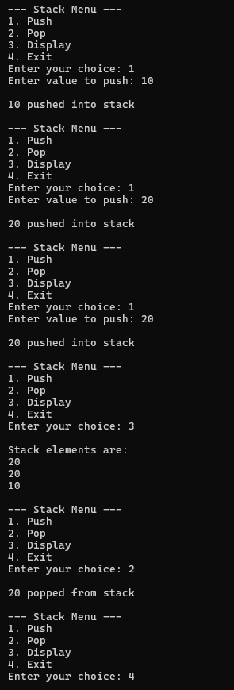
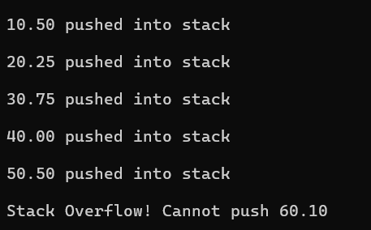
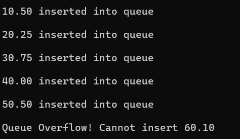
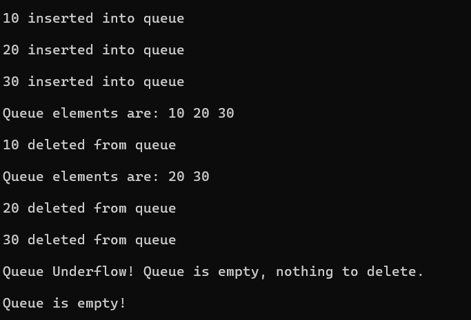

# EXP NO:11 C PROGRAM TO DISPLAY STACK ELEMENTS USING AN ARRAY.

## Aim:
To write a C program to display stack elements using an array.

## Algorithm:
1.	Include Necessary Header Files
2.	Declare Global Variables
3.	Define the Display Function
4.	Main Function (or Other Relevant Code)
5.	Initialize the stack and top as needed.
6.	Perform stack operations (push, pop, etc.).
7.	Use the display function to visualize the stack's contents
 
## Program:

```c
#include <stdio.h>
#define MAX 5  

int stack[MAX];
int top = -1;

void push(int item) 
{
    if (top == MAX - 1) 
	{
        printf("\nStack Overflow! Cannot push %d\n", item);
    } else 
	{
        top++;
        stack[top] = item;
        printf("\n%d pushed into stack\n", item);
    }
}

void pop() 
{
    if (top == -1) 
	{
        printf("\nStack Underflow! Cannot pop\n");
    } else {
        printf("\n%d popped from stack\n", stack[top]);
        top--;
    }
}

void display() 
{
    if (top == -1) 
	{
        printf("\nStack is empty!\n");
    } else {
        printf("\nStack elements are:\n");
        for (int i = top; i >= 0; i--) 
		{
            printf("%d\n", stack[i]);
        }
    }
}

int main() 
{
    int choice, value;

    while (1) 
	{
        printf("\n--- Stack Menu ---\n");
        printf("1. Push\n2. Pop\n3. Display\n4. Exit\n");
        printf("Enter your choice: ");
        scanf("%d", &choice);

        switch (choice) 
		{
        case 1:
            printf("Enter value to push: ");
            scanf("%d", &value);
            push(value);
            break;
        case 2:
            pop();
            break;
        case 3:
            display();
            break;
        case 4:
            return 0;
        default:
            printf("\nInvalid Choice! Try again.\n");
        }
    }
}
```
## Output:




## Result:
Thus, the program to display stack elements using an array is verified successfully.
 
---

# EXP NO:12  PROGRAM TO PUSH THE GIVEN ELEMENT IN TO A STACK USING ARRAY.

## Aim:
To create a C program to push the given element in to a stack using array.

## Algorithm:
1.	Declare global variables for the stack size, top index, and the stack itself.
2.	Define the push function to add a floating-point number to the stack.
3.	Initialize the stack size, top index, and the stack itself.
4.	Call the push function as needed.
 
## Program:

``` c
#include <stdio.h>
#define MAX 5   

float stack[MAX];
int top = -1;

void push(float item) 
{
    if (top == MAX - 1) 
	{
        printf("\nStack Overflow! Cannot push %.2f\n", item);
    } else {
        top++;
        stack[top] = item;
        printf("\n%.2f pushed into stack\n", item);
    }
}

// Main function
int main() 
{
    // Pushing elements into stack
    push(10.5);
    push(20.25);
    push(30.75);
    push(40.0);
    push(50.5);
    push(60.1);  // This will show overflow

    return 0;
}
```

## Output:




## Result:
Thus, the program to push the given element in to a stack using array is verified successfully

---
 
# EXP NO:13 C PROGRAM TO DISPLAY QUEUE ELEMENTS USING ARRAY.

## Aim:
To write a C program to display queue elements using array

## Algorithm:
1.	Declare global variables for the queue, rear, front, and iteration.
2.	Define the display function to print the elements of the queue.
3.	Initialize the queue, rear, and front as needed.
4.	Call the display function and perform other queue operations as needed.
 
## Program:

``` c
#include <stdio.h>
#define MAX 5   

int queue[MAX];
int front = -1, rear = -1;

void enqueue(int item) 
{
    if (rear == MAX - 1) 
	{
        printf("\nQueue Overflow! Cannot insert %d\n", item);
    } else {
        if (front == -1) front = 0; 
        rear++;
        queue[rear] = item;
        printf("\n%d inserted into queue\n", item);
    }
}

void dequeue() 
{
    if (front == -1 || front > rear) 
	{
        printf("\nQueue Underflow! Cannot delete\n");
    } else {
        printf("\n%d deleted from queue\n", queue[front]);
        front++;
    }
}

void display() 
{
    if (front == -1 || front > rear) 
	{
        printf("\nQueue is empty!\n");
    } else {
        printf("\nQueue elements are:\n");
        for (int i = front; i <= rear; i++) 
		{
            printf("%d ", queue[i]);
        }
        printf("\n");
    }
}

int main() 
{
    enqueue(10);
    enqueue(20);
    enqueue(30);
    display();

    dequeue();
    display();

    enqueue(40);
    enqueue(50);
    enqueue(60);  
    display();

    return 0;
}
```

## Output:


## Result:
Thus, the program to display queue elements using array is verified successfully.

---
 
# EXP NO:14 C PROGRAM TO INSERT ELEMENTS IN QUEUE USING ARRAY.

## Aim:
To write a C program to insert elements in queue using array.

## Algorithm:
1.	Declare global variables for the size, rear, front, and the queue itself.
2.	Define the enqueue function to add a float to the queue.
3.	Initialize the rear, front, and size of the queue as needed.
4.	Call the enqueue function as needed.

## Program:

``` c
#include <stdio.h>
#define MAX 5  

float queue[MAX];
int front = -1, rear = -1;

void enqueue(float item) 
{
    if (rear == MAX - 1) 
	{
        printf("\nQueue Overflow! Cannot insert %.2f\n", item);
    } else {
        if (front == -1) 
		{
            front = 0; // first insertion
        }
        rear++;
        queue[rear] = item;
        printf("\n%.2f inserted into queue\n", item);
    }
}

int main() {
    enqueue(10.5);
    enqueue(20.25);
    enqueue(30.75);
    enqueue(40.0);
    enqueue(50.5);
    enqueue(60.1); 

    return 0;
}

```

## Output:



## Result:
Thus, the program to insert elements in queue using array is verified successfully.


---
 
# EXP NO:15 C FUNCTION TO DELETE ELEMENTS IN QUEUE USING ARRAY


## Aim:

To create a function in C that deletes an element from a queue implemented using an array.

## Algorithm:

1.	Check if the Queue is Empty
o	If the front pointer is -1, it means the queue is empty, and there are no elements to delete. Print a message indicating that the queue is empty.
2.	Delete the Front Element
o	If the queue is not empty, the element at the front index is deleted.
o	Increment the front pointer by 1 to remove the element and point to the next element in the queue.
3.	Check if the Queue Becomes Empty After Deletion:
o	After deletion, check if the front pointer has passed the rear pointer (front > rear). If this is true, reset both front and rear to -1, indicating that the queue is now empty.
4.	End the Function.


## Program:

``` c
#include <stdio.h>
#define MAX 5   

int queue[MAX];
int front = -1, rear = -1;

void enqueue(int item) 
{
    if (rear == MAX - 1) 
	{
        printf("\nQueue Overflow! Cannot insert %d\n", item);
    } else {
        if (front == -1) 
		{
            front = 0; 
        }
        rear++;
        queue[rear] = item;
        printf("\n%d inserted into queue\n", item);
    }
}

void dequeue() 
{
    if (front == -1) 
	{
        printf("\nQueue Underflow! Queue is empty, nothing to delete.\n");
    } else {
        printf("\n%d deleted from queue\n", queue[front]);
        front++;

        if (front > rear) 
		{
            front = rear = -1;
        }
    }
}

void display() 
{
    if (front == -1) 
	{
        printf("\nQueue is empty!\n");
    } else {
        printf("\nQueue elements are: ");
        for (int i = front; i <= rear; i++) 
		{
            printf("%d ", queue[i]);
        }
        printf("\n");
    }
}

int main() 
{
    enqueue(10);
    enqueue(20);
    enqueue(30);
    display();

    dequeue();
    display();

    dequeue();
    dequeue();
    dequeue();
    display();

    return 0;
}

```

## Output:



## Result:
Thus, the function that deletes an element from a queue implemented using an array is verified successfully.
